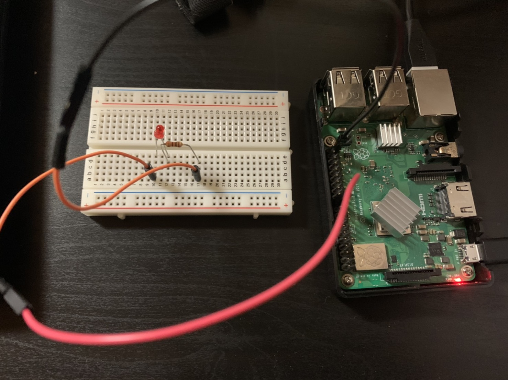

## 内容
* 上記のプログラム等はRasberryPiを用いたデバイスドライバです．
* 以下の要件に従って実行するとLEDを点灯・点滅させることができます．

## 環境
* Rasberry Pi3 
* ubuntu20.04 lts(wsl2)  
* 回路は以下の写真を参考にLEDの+側を25PIN，-側をGNDに接続  


## 実行方法

* ラズパイのIPアドレスを取得(コマンドプロンプトで`arp -a`を入力して検索等)して，ラズパイ環境内に入る  
`$ ssh ubuntu@[取得したIPアドレス] ` 

* gitがなかったらインストール  
`$ sudo apt install git`  

* robosys-myledをgitでダウンロード  
```
$ cd ~
$ git clone https://github.com//hikaru-tsunekawa/robosys-myled.git
$ cd robosys-myled
```

* makeしてコンパイル  
`$ make`

## カーネルモジュールのインストール  
* ismodでインストール  
`$ sudo insmod myled.ko`  
* 読み込み書き込み権限付与  
`$ sudo chmod 666 /dev/myled0`

## LED点灯

* LED点灯  
`$ echo 1 > /dev/myled0`
* LED消灯  
`$ echo 0 > /dev/myled0`
* LED 5回点灯  
`$ echo 2 > /dev/myled0`

## カーネルモジュールのアンインストール
* rmmodでアンインストール  
`$ sudo rmmod myled.ko`  
* make cleanでカーネルモジュールを消す  
`$ make clean`

## Youtube動画URL
https://youtu.be/leq77MlavLQ

## 参考URL

* ロボットシステム学  
https://github.com/ryuichiueda/robosys2020

* Linuxカーネルでスリープする方法  
https://www.it-swarm-ja.tech/ja/c/linux%E3%82%AB%E3%83%BC%E3%83%8D%E3%83%AB%E3%81%A7%E3%82%B9%E3%83%AA%E3%83%BC%E3%83%97%E3%81%99%E3%82%8B%E6%96%B9%E6%B3%95/1072151555/


